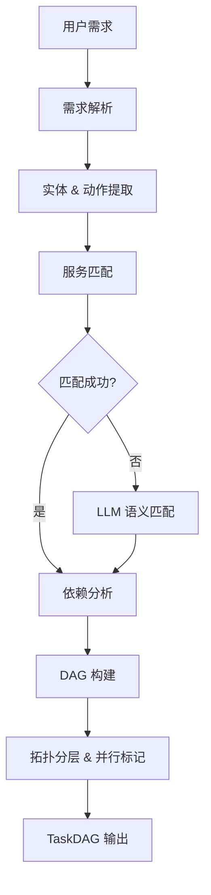
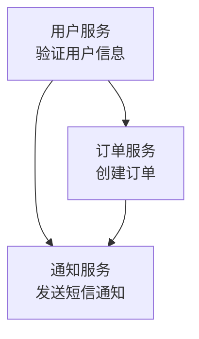

# AI Agent 任务拆解 — 设计文档

> 状态：原型 | 版本：v1.0 | 日期：2026-06-26

## 1. 问题定义

让 AI Agent 自动分析一个自然语言需求 + 微服务接口文档，输出结构化的变更任务 DAG（有向无环图），标注各任务的依赖关系和并行执行分组。

**输入**：用户需求（自然语言）+ 微服务文档列表（名称/描述/职责/接口）

**输出**：`TaskDAG` — 包含节点（服务+操作+描述）、依赖边、并行执行分组

## 2. 拆解算法

```
输入: requirement (str), service_docs (list[dict])
输出: TaskDAG

Step 1 — 需求解析 (LLM)
  提取 entities (实体: 用户/订单/支付/通知) 和 actions (动作: 创建/更新/发送/校验)
  → entities[], actions[]

Step 2 — 服务匹配 (启发式 + LLM fallback)
  将 entities 与 service_docs 的名称/描述/职责做匹配
  优先使用关键词启发式匹配 (低延迟)，无匹配时回退 LLM 语义匹配
  → affected_services[]

Step 3 — 依赖分析 (LLM)
  分析受影响服务之间的执行顺序：
  - 订单创建后才能支付 → 支付依赖订单
  - 支付成功后发送通知 → 通知依赖支付
  结合服务文档中声明的接口依赖关系
  → dependencies: {service_a: [service_b, ...]}

Step 4 — DAG 构建 (拓扑分层)
  根据依赖关系做拓扑排序，每一层内无依赖关系的节点可并行执行
  标记并行分组: [[task1, task2], [task3], [task4, task5]]
  → TaskDAG
```

## 3. 架构流程图



## 4. 示例 Walkthrough

### 需求
> "用户下单后自动发送短信通知"

### 微服务文档（模拟）

| 服务 | 职责 | 接口 |
|------|------|------|
| 用户服务 (user-service) | 用户信息管理 | GET /users/{id}, POST /users |
| 订单服务 (order-service) | 订单创建与查询 | POST /orders, GET /orders/{id} |
| 支付服务 (payment-service) | 支付处理 | POST /payments, 依赖 order-service |
| 通知服务 (notification-service) | 消息推送（短信/邮件） | POST /notifications/sms, 依赖 user-service |

### Step 1: 需求解析
```json
{
  "entities": ["用户", "订单", "通知", "短信"],
  "actions": ["创建", "发送", "通知"]
}
```

### Step 2: 服务匹配
- "用户" → user-service (名称匹配)
- "订单" → order-service (名称匹配)
- "通知/短信" → notification-service (职责匹配)

受影响服务: [user-service, order-service, notification-service]

### Step 3: 依赖分析
- notification-service 需要知道用户手机号 → 依赖 user-service
- 订单创建后才能通知 → notification-service 依赖 order-service
- order-service 创建订单需要用户验证 → 依赖 user-service

```json
{
  "dependencies": {
    "order-service": ["user-service"],
    "notification-service": ["order-service", "user-service"]
  }
}
```

### Step 4: DAG 构建



**并行分组**:
- Group 1: [task_user_service]（无依赖，立即执行）
- Group 2: [task_order_service]（依赖 task_user_service 完成）
- Group 3: [task_notification_service]（依赖 task_order_service + task_user_service）

## 5. 数据结构

```python
@dataclass
class TaskNode:
    id: str               # "task_order_service"
    service: str          # "order-service"
    action: str           # "create_order"
    description: str      # "创建用户订单"
    dependencies: list[str]  # ["task_user_service"]

@dataclass
class TaskDAG:
    requirement: str
    nodes: list[TaskNode]
    parallel_groups: list[list[str]]  # [["task1","task2"],["task3"]]
```

## 6. 局限性

- **原型阶段**：服务匹配在复杂场景下依赖 LLM，延迟和可靠性待验证
- **无实际执行**：当前仅输出 DAG 结构，不负责调度或执行
- **服务文档质量敏感**：文档描述越详细，匹配效果越好；模糊文档导致误匹配
- **无循环依赖检测**：假设输入的服务依赖关系无环

## 7. 后续扩展方向

- **工具调用**：根据 DAG 实际调用各微服务 API
- **人工确认**：关键变更节点插入人工审批
- **回滚计划**：为每个节点生成回滚操作
- **动态重规划**：执行过程中某节点失败时自动重排后续节点
